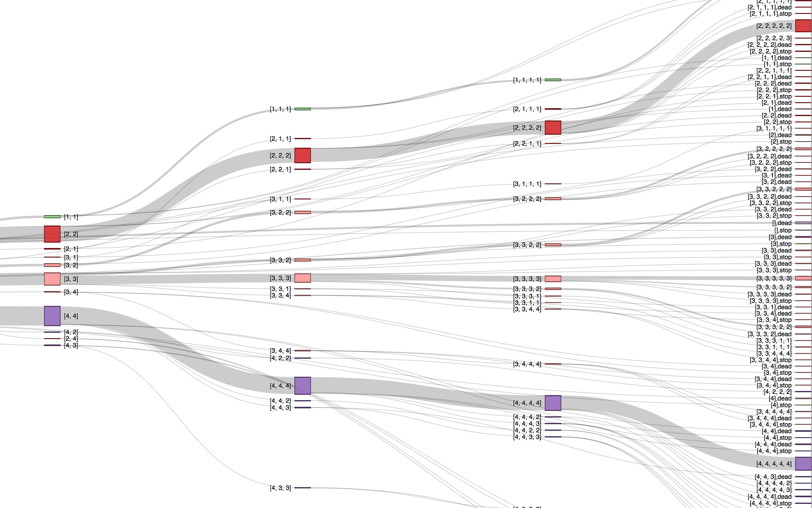

# Health hack 2015


## Treatment trees

Generating histories from records:

```
cd data/TreatmentTrees/ && ./bin/generate_history TreatmentTree_MockData_20151024.txt > result.txt
```

https://github.com/dziemid/healthhack2015/blob/master/data/TreatmentTrees/alluvial_plot_code.R



## Spike with Neo4J

Getting Neo4j

```
docker run --detach --publish=7474:7474 --volume=$HOME/neo4j-data:/data neo4j/neo4j
```

Loading data into Neo4J

```
USING PERIODIC COMMIT
LOAD CSV WITH HEADERS FROM "https://raw.githubusercontent.com/dziemid/healthhack2015/master/data/TreatmentTrees/TreatmentTree_MockData_20151024.txt" AS row
CREATE (n:Treatment)
SET n = row,
  n.person = toInt(row.id),
  n.treatment = toInt(row.treatment),
  n.age = toFloat(row.age),
  n.bmi = toFloat(row.bmi),
  n.diabetes = toInt(row.diabetes),
  n.dead = (row.deadind <> "0"),
  n.stop_treatment = (row.stop_treatment <> "0"),
  n.period = toInt(row.period),
  n.sex = toInt(row.sex)
```

Adding index

```
CREATE INDEX ON :Treatment(person)
```

Linking records

```
MATCH (a)
WHERE (NOT (a)-[:FOLLOWED_BY]->())
MATCH (b)
WHERE  a.person = b.person  AND a.period = (b.period-1)
CREATE (a)-[:FOLLOWED_BY]->(b)
```

Quering

```
MATCH (a:Treatment)
WITH DISTINCT a.person AS pp
MATCH (b:Treatment{person: pp}) 
WITH pp, MAX(b.period) AS last_period
MATCH p =(start:Treatment { period: 1, person: pp })-[:FOLLOWED_BY*]-(last:Treatment {  period: last_period, person: pp} )
RETURN extract(n IN nodes(p)| n.treatment) as `trajectory`, length(p),start.sex,last.dead,count(*) as total
ORDER BY total DESC 
```
